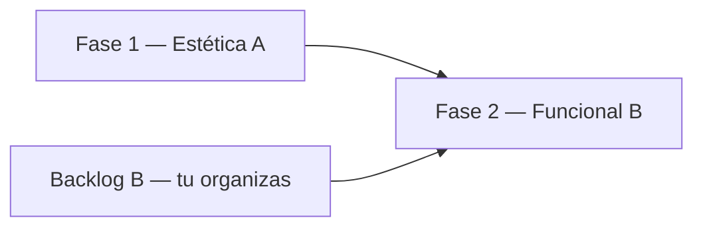

# Plano de ação — Painel Admin (`/admin`)

**Objetivo:** reestruturação estética (Fase 1) + melhorias funcionais (Fase 2), com o painel focado em **governança do sistema** (não duplicar o painel operacional do Gestor na home).

**Decisões fechadas:**

| Tema | Decisão |
|------|---------|
| Âmbito do `/admin` | Só administrativo (contas, logs, sistema). Analytics operacionais ficam na home `/` para Admin/Gestor. |
| Backups (download/restauro) | ✅ Implementado (B15–B16); job diário em `DatabaseBackupHostedService`. |
| Fase 1 vs 2 | **Primeiro** redesign visual (A). **Depois** funcionalidades (B) — priorizas tu o backlog abaixo. |

**Código:** `apps/web/app/admin/` · **API:** [API.md](../API.md) (`/api/admin`) · **Estado atual:** [PAINEL-ADMIN.md](PAINEL-ADMIN.md)

---

## Visão das fases

| Fase | O quê | Quem prioriza |
|------|--------|----------------|
| **1 — Estética (A)** | Layout, componentes, UX, polish, escopo admin puro no dashboard | Plano abaixo — implementar em sequência |
| **2 — Funcional (B)** | Novos fluxos, filtros com API, ações sobre utilizadores, export, etc. | **Backlog** no fim deste documento — marcas prioridade quando quiseres |

---

## Fase 1 — Redesign estético (A)

### 1.0 Fundação (design system do painel)

| # | Tarefa | Detalhe |
|---|--------|---------|
| 1.0.1 | Tokens e classes partilhadas | Ficheiro tipo `adminTheme.ts` ou extensão de `_components`: cores, radius, sombras, tipografia alinhadas a PIROFAFE (laranja `#f97316`, superfícies claro/escuro). |
| 1.0.2 | Evoluir `_components/` | `AdminPageHeader`, `AdminCard`, `AdminSection`, `StatCard`, sidebar — API de props estável (título, descrição, ação, variantes `danger`/`muted`). |
| 1.0.3 | Padrões de feedback | Preparar `AdminConfirmDialog` + toasts (substituir `window.confirm` / `alert` nas páginas admin). |
| 1.0.4 | Ícones de navegação | Corrigir ícone Dashboard (grelha, não relógio). Revisar labels e grupos **Geral** / **Sistema**. |

**Entregável:** painel com identidade visual coerente e componentes reutilizáveis.

---

### 1.1 Layout global (`layout.tsx`)

| # | Tarefa | Detalhe |
|---|--------|---------|
| 1.1.1 | Sidebar | Largura fixa, estado ativo claro, rodapé opcional (versão / link documentação). |
| 1.1.2 | Mobile | Menu colapsável com animação leve; área de conteúdo sem saltos de layout. |
| 1.1.3 | Breadcrumb | Integrado no header de página, não duplicado. |
| 1.1.4 | Atalho “Sair do painel” | Link visível para `/` ou app principal (Admin usa também a home operacional). |

---

### 1.2 Dashboard (`/admin`) — só admin

| # | Tarefa | Detalhe |
|---|--------|---------|
| 1.2.1 | Remover dependência forte de `gestor-dashboard` | Gráficos de encomendas por mês/estado são **operacionais**; no redesign: ou retirar do `/admin` ou substituir por 1 bloco compacto “Atalhos” (links para `/encomendas`, etc.) sem charts pesados. **Preferência acordada:** métricas de sistema + alertas admin. |
| 1.2.2 | Secção **Em atenção** | Cards uniformes: pendentes de confirmação de email, total utilizadores, logs recentes (últimas 24h se existir contagem), link direto para secção certa. |
| 1.2.3 | Secção **Métricas** | Grelha de `StatCard` por grupo (Contas, Atividade, Entidades, Armazém, Sistema) — hierarquia visual (título de grupo + cards). |
| 1.2.4 | **Atividade recente** | Feed de logs (mantém API `GET /admin/logs`) — timeline mais legível, menos densidade. |
| 1.2.5 | Empty / loading / error | Estados vazios com mensagem e CTA (ex.: “Ver utilizadores”). |

**Nota:** `GET /api/admin/stats` mantém-se; alertas que hoje usam `gestor` (encomendas pendentes, paióis) passam a **links externos** ou saem do dashboard admin.

---

### 1.3 Utilizadores (`/admin/utilizadores`)

| # | Tarefa | Detalhe |
|---|--------|---------|
| 1.3.1 | Barra de ferramentas | Pesquisa + filtro role numa linha; contador “X de Y”; espaço para chips de filtro (preparar UI para Fase 2). |
| 1.3.2 | Tabela | Cabeçalho sticky, linhas com hover, coluna email/estado mais clara; corrigir `key` no React (fragment → `Fragment` com key ou linha única). |
| 1.3.3 | Edição inline | Painel expansível com animação; roles como toggles; select funcionário alinhado ao design system. |
| 1.3.4 | Ações | Botões Editar / Eliminar com confirmação via modal (não `confirm` nativo). |
| 1.3.5 | Empty states | Sem utilizadores vs sem resultados de pesquisa. |

---

### 1.4 Logs (`/admin/logs`) — ✅

| # | Tarefa | Detalhe |
|---|--------|---------|
| 1.4.1 | Filtros | Painel colapsável “Filtros”; pills de categoria; chips de filtros ativos; botão “Aplicar” / “Limpar”. |
| 1.4.2 | Lista | Agrupamento por data mantido; badges de ação consistentes com dashboard. |
| 1.4.3 | Paginação | Barra fixa no fundo em desktop; tamanho de página visível. |
| 1.4.4 | JSON | Bloco expandível com syntax legível (já existe — polish). |

Implementação: [`apps/web/app/admin/logs/page.tsx`](../../apps/web/app/admin/logs/page.tsx), [`logs/AdminLogsFilters.tsx`](../../apps/web/app/admin/logs/AdminLogsFilters.tsx) (reactivo, debounce, chips activos, presets de período), [`logs/_components/LogsList.tsx`](../../apps/web/app/admin/logs/_components/LogsList.tsx).

---

### 1.5 Definições (`/admin/definicoes`)

| # | Tarefa | Detalhe |
|---|--------|---------|
| 1.5.1 | Backups | Card único: executar + histórico; download `.bak`/ZIP, restauro e apagar ficheiro. |
| 1.5.2 | Limpeza de dados | Secção `danger zone` visual (borda vermelha, texto de aviso); manter dois botões mas com **rótulos e descrições** que expliquem Admin API vs Home API. |
| 1.5.3 | Sobre o painel | Atualizar lista de capacidades após Fase 1 (sem prometer features do backlog). |

---

### 1.6 Qualidade e documentação (fim Fase 1)

| # | Tarefa | Detalhe |
|---|--------|---------|
| 1.6.1 | Dark mode | Rever contraste em todos os ecrãs admin. |
| 1.6.2 | Acessibilidade | Focus visible, `aria-label` em ícones, tabelas com scope em `<th>`. |
| 1.6.3 | Atualizar [PAINEL-ADMIN.md](PAINEL-ADMIN.md) | Rotas, layout, o que o dashboard mostra após remoção/aligeiramento de charts gestor. |
| 1.6.4 | Screenshots opcionais | Pasta `Docs/frontend/assets/` se quiseres referência visual no README. |

---

### Ordem de implementação recomendada (Fase 1)

1. **1.0** Fundação (`_components`, tema, dialog)  
2. **1.1** Layout  
3. **1.2** Dashboard (define o “tom” do painel)  
4. **1.3** Utilizadores  
5. **1.4** Logs  
6. **1.5** Definições  
7. **1.6** QA + docs  

**Estimativa de esforço (orientativa):** 1–2 sessões de trabalho focado por bloco (1.0+1.1, depois 1.2, etc.).

---

### Critérios de aceitação — Fase 1

- [x] Painel visualmente alinhado ao resto da app (PIROFAFE, dark mode).
- [x] `/admin` não depende de widgets do painel Gestor para parecer “completo”.
- [x] Sem `alert()` / `confirm()` nativos nas páginas admin (modais/toasts).
- [x] Navegação sidebar + mobile estável; breadcrumbs corretos em todas as rotas.
- [x] Tabela utilizadores sem warnings React de `key`.
- [x] Documentação [PAINEL-ADMIN.md](PAINEL-ADMIN.md) atualizada.

---

## Fase 2 — Backlog funcional (B)

**Instrução:** prioriza e agrupa à vontade (MVP / v2 / nunca). Quando fores implementar, marca estado na coluna **Estado**.

| ID | Funcionalidade | Notas | API nova? | Estado |
|----|----------------|-------|-----------|--------|
| **B01** | Filtro rápido “Email por confirmar” na lista utilizadores | Pode ser só cliente (`emailConfirmed === false`) | Não | ✅ Feito |
| **B02** | Alerta dashboard → abrir utilizadores já filtrados (`?filtro=email-pendente`) | Query param + ler na página | Não | ✅ Feito |
| **B03** | Reenviar email de confirmação | Identity / serviço email | **Sim** | ✅ Feito |
| **B04** | Confirmar email manualmente (admin) | Política de segurança a definir | **Sim** | ✅ Feito |
| **B05** | Criar utilizador no painel admin | Email, password, roles, opcional funcionário | **Sim** | ✅ Feito |
| **B06** | Repor palavra-passe de utilizador | Envio por email ou password temporária | **Sim** | ✅ Feito |
| **B07** | Editar email / username do utilizador | Cuidado com unicidade e sessões | **Sim** | ✅ Feito |
| **B08** | Filtro “Sem funcionário associado” | Lista já traz `funcionarioAssociadoNome` | Não | ✅ Feito |
| **B09** | Exportar logs (CSV ou JSON) | Export da página atual no browser | Não | ✅ Feito (página) |
| **B10** | Filtro logs por tipo de entidade (encomenda, cliente, …) | Filtro `entidade` na API + pills na UI | **Sim** | ✅ Feito |
| **B11** | Unificar ou esconder “Limpar dados” duplicado | Um fluxo claro; esconder Admin API em produção | Não / config | ✅ Feito |
| **B12** | Indicador bootstrap “primeiro registo disponível” | `GET /api/auth/existem-utilizadores` | Não | ✅ Feito |
| **B13** | Health / estado da API no painel | `GET /api/admin/health` + badge dashboard / card definições | **Sim** | ✅ Feito |
| **B14** | Gestão fina de `permissions` (além das 4 roles) | Hoje só roles no Identity | **Sim** (grande) | ⏸️ Fora de âmbito MVP |
| **B15** | Backups: download ficheiro `.bak` | Segurança, path, auth | **Sim** | ✅ Feito |
| **B16** | Backups: restaurar / apagar ficheiro | Muito sensível | **Sim** | ✅ Feito |
| **B17** | Agendamento de backups automáticos | Config + job (`Backups:HoraDiaria`) | **Sim** | ✅ Feito (hosted service) |
| **B18** | Definições sistema (SMTP, nome app, manutenção) | Configuração centralizada | **Sim** | ⏸️ Fora de âmbito MVP |
| **B19** | Testes E2E fluxos admin (utilizadores, logs, backup) | Playwright `admin.smoke.spec.ts` | Não | ✅ Feito |

### Sugestão de agrupamento (opcional — editas tu)

| Grupo | IDs | Comentário |
|-------|-----|------------|
| **Quick wins (só frontend)** | B01, B02, B08, B11, B12 | Depois da Fase 1 estética |
| **Contas** | B03–B07 | Maior valor; precisa API |
| **Auditoria** | B09, B10 | Export e filtros avançados |
| **Infra (mais tarde)** | B15–B18 | Inclui backups quando revires o sistema |
| **Qualidade** | B19 | CI |

---

## Ficheiros principais (referência)

| Área | Ficheiros |
|------|-----------|
| Layout / nav | `apps/web/app/admin/layout.tsx` |
| Dashboard | `apps/web/app/admin/page.tsx` |
| Utilizadores | `apps/web/app/admin/utilizadores/page.tsx`, `_components/` |
| Logs | `apps/web/app/admin/logs/page.tsx`, `logs/AdminLogsFilters.tsx`, `logs/_components/` |
| Definições | `apps/web/app/admin/definicoes/page.tsx` |
| Componentes | `apps/web/app/admin/_components/*` |
| API client | `apps/web/app/lib/admin.ts` |
| Backend | `src/Finalproj.Api/Controllers/AdminController.cs` |

---

## Estado do plano (maio 2026)

| Fase | Estado |
|------|--------|
| **Fase 1 — Estética (A)** | ✅ Completa (critérios de aceitação cumpridos) |
| **Fase 2 — Backlog (B)** | ✅ Itens em âmbito implementados (B01–B13, B15–B17, B19) |
| **Adiados** | B14 (permissions finas), B18 (config sistema centralizada) |
| **Fase 5 — Escala (v2)** | Paginação server-side de utilizadores; off-site backups — ver [OPERACOES.md](../OPERACOES.md) |

## Próximo passo (opcional)

- B14 / B18 se quiseres evoluir permissões ou configuração SMTP/app fora do código.  
- Paginação de `GET /api/admin/utilizadores` quando o número de contas crescer.

*Documento criado para acompanhar o redesign do painel Admin — maio 2026.*
