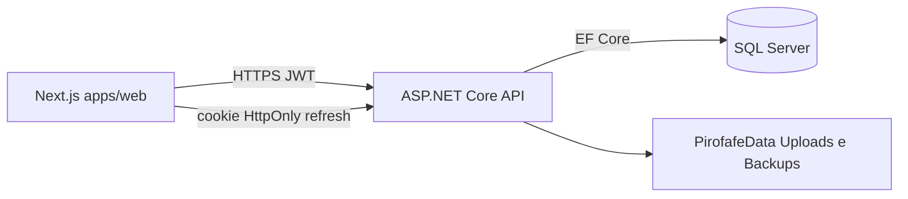

# Sistema de Gestão Pirotécnica

[](https://github.com/Vie1r4/Finalproj/actions/workflows/dotnet-tests.yml)
[](https://github.com/Vie1r4/Finalproj/actions/workflows/client-ci.yml)

Aplicação **full-stack** desenvolvida para a **Pirofafe**, empresa pirotécnica. Cobre armazéns (paióis), stock (MLE/NEM), encomendas, serviços no terreno, clientes, funcionários e documentação regulamentar (PSP).

> **Nota:** Pirofafe é o **cliente**; este repositório é o **software de gestão** feito para essa empresa, não um produto comercial com o mesmo nome.

**Stack:** ASP.NET Core 8 · EF Core · SQL Server · Next.js 16 · React 19 · TypeScript

## Funcionalidades

- **Paióis e stock** — entradas/saídas, validação ADR/RFACEPE, lotação MLE, FIFO na preparação de encomendas
- **Encomendas** — estados, reservas de stock, fluxo comercial → armazém
- **Serviços** — equipa, licenças, zonas de lançamento, distâncias de segurança, declaração PSP (PDF)
- **Catálogo** — produtos, compilados, classificação de risco
- **Utilizadores** — JWT + refresh HttpOnly, roles (Admin, Gestor, Comercial, Armazém)
- **Operações** — backups automáticos da BD e documentos, painel admin, analytics do gestor

## Documentação

**Índice:** [**Docs/README.md**](Docs/README.md)

| Área | Ligação |
|------|---------|
| Visão geral | [Docs/VISAO-GERAL.md](Docs/VISAO-GERAL.md) |
| Arquitetura | [Docs/ARQUITETURA.md](Docs/ARQUITETURA.md) |
| API | [Docs/API.md](Docs/API.md) |
| Testes | [Docs/TESTES.md](Docs/TESTES.md) |
| Segurança | [Docs/SEGURANCA.md](Docs/SEGURANCA.md) |
| Produção | [Docs/PRODUCAO.md](Docs/PRODUCAO.md) |
| Roles | [Docs/ROLES-E-PERMISSOES.md](Docs/ROLES-E-PERMISSOES.md) |
| Operações | [Docs/OPERACOES.md](Docs/OPERACOES.md) |

## Arquitetura (resumo)



## Estrutura

```
Finalproj/
├── src/Finalproj.Api/              # API REST (controllers, Program.cs)
├── src/Finalproj.Application/      # Casos de uso, DTOs, validadores
├── src/Finalproj.Domain/           # Entidades, Legislacao/, contratos
├── src/Finalproj.Infrastructure/   # EF Core, repositórios, serviços I/O
├── apps/web/                       # Frontend Next.js 16
├── Finalproj.Tests/                # Testes unitários (domínio)
├── Finalproj.IntegrationTests/     # Testes de integração HTTP (auth, 401/403)
└── Docs/                           # Documentação
```

- **`apps/web/`:** React 19, TanStack Query, Tailwind, Leaflet; chamadas API em `app/lib/*Api.ts`.
- Ver [CONTRIBUTING.md](CONTRIBUTING.md) para convenções e checklist de PR.

## Swagger

Com o backend em **Development**, a UI Swagger está em `/swagger` (ex.: `https://localhost:7225/swagger`) — autenticação JWT com **Authorize** após `POST /api/auth/login`.

Em **Production** o Swagger fica desligado.

## Testes

```bash
dotnet test Finalproj.sln -c Release
```

```bash
cd apps/web
npm test              # Vitest (unitário)
npm run test:e2e      # Playwright E2E
```

CI: [.NET tests](.github/workflows/dotnet-tests.yml) e [Client](.github/workflows/client-ci.yml). Ver [Docs/TESTES.md](Docs/TESTES.md).

## Pré-requisitos

- .NET 8 SDK
- Node.js 20+
- SQL Server (LocalDB ou instância)

## Configuração

### Backend — segredos (obrigatório)

O JWT **não** deve estar em `appsettings.json`. Use **User Secrets** em desenvolvimento:

```bash
cd <raiz-do-projeto>
dotnet user-secrets set "Jwt:Secret" "sua-chave-secreta-longa-com-pelo-menos-32-caracteres" --project src/Finalproj.Api/Finalproj.Api.csproj
dotnet user-secrets set "Jwt:Issuer" "Finalproj" --project src/Finalproj.Api/Finalproj.Api.csproj
dotnet user-secrets set "Jwt:Audience" "FinalprojUsers" --project src/Finalproj.Api/Finalproj.Api.csproj
dotnet user-secrets set "Frontend:BaseUrl" "http://localhost:3000" --project src/Finalproj.Api/Finalproj.Api.csproj
```

Produção: variáveis de ambiente — ver [`.env.example`](.env.example) e [Docs/PRODUCAO.md](Docs/PRODUCAO.md).

Opcional (email): `Email:SmtpHost`, `Email:SmtpUser`, `Email:SmtpPassword`, `Email:From` — ver [Docs/SEGURANCA.md](Docs/SEGURANCA.md).

### Frontend

Copiar [`apps/web/.env.example`](apps/web/.env.example) para `apps/web/.env.local` e ajustar `NEXT_PUBLIC_API_URL` se necessário.

### CORS

Por defeito: `http://localhost:3000` e `https://localhost:3000`. Em produção, defina `Cors:AllowedOrigins`.

### Logs e backups

- Pedidos HTTP incluem **`X-Correlation-Id`** — ver [Docs/OPERACOES.md](Docs/OPERACOES.md#observabilidade-http).
- Backups automáticos diários da BD + documentos — [Docs/OPERACOES.md](Docs/OPERACOES.md).

## Executar (local)

### Backend

```bash
dotnet run --project src/Finalproj.Api/Finalproj.Api.csproj
```

API em `https://localhost:7225` (porta em `src/Finalproj.Api/Properties/launchSettings.json`).

### Frontend

```bash
cd apps/web
npm install
npm run dev
```

Abre [http://localhost:3000](http://localhost:3000).

## Primeiro utilizador

Com `Bootstrap:AllowFirstUserRegistration=true` (por defeito em **Development**), a página de login mostra **Criar primeiro utilizador** enquanto não existir nenhuma conta — recebe role **Admin**.

Em produção, defina `Bootstrap__AllowFirstUserRegistration=false` após criar o administrador inicial.

## Painel Admin

Rotas em `apps/web/app/admin/`. Documentação: [Docs/frontend/PAINEL-ADMIN.md](Docs/frontend/PAINEL-ADMIN.md).

- **Limpar todos os dados:** só visível fora de `production` (a API exige ambiente Development).
- **Backups e restauro:** [Docs/OPERACOES.md](Docs/OPERACOES.md).

## Autor

**Sérgio Henrique Oliveira Vieira** — [GitHub @Vie1r4](https://github.com/Vie1r4)

Software de gestão pirotécnica desenvolvido para a **Pirofafe** — full-stack (.NET, Next.js, domínio regulado).

### Sugestão para o repositório GitHub

| Campo | Valor sugerido |
|-------|----------------|
| **Description** | Full-stack management system for a pyrotechnics company — ASP.NET Core 8 + Next.js 16 |
| **Topics** | `aspnet-core`, `nextjs`, `ef-core`, `typescript`, `full-stack`, `sql-server` |
| **Website** | *(deixar vazio até haver deploy)* |

Não é necessário renomear o repositório para «pirofafe» — o nome `Finalproj` ou algo como `gestao-pirotecnica` funciona bem para portfólio.
