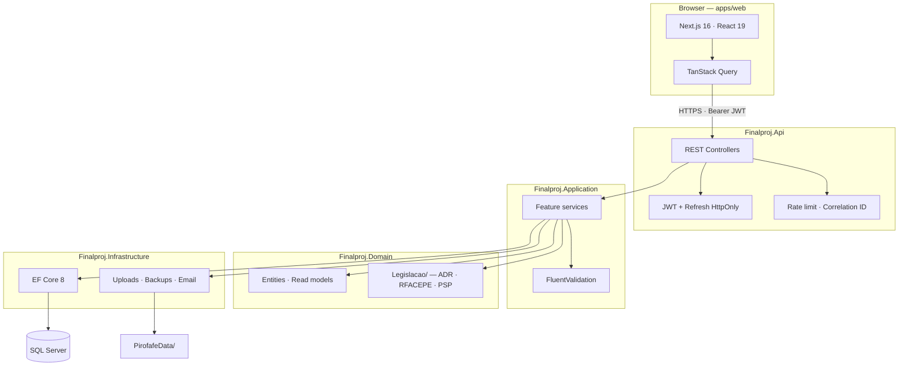

# Pyrotechnics Operations Platform

**Full-stack management system for a regulated pyrotechnics company — warehouses, stock, orders, field services, and PSP compliance.**

[](https://github.com/Vie1r4/sistema-gestao-pirotecnica/actions/workflows/dotnet-tests.yml)
[](https://github.com/Vie1r4/sistema-gestao-pirotecnica/actions/workflows/client-ci.yml)
[](#demo-credentials)

Built for **Pirofafe** — a real pyrotechnics business. This repository is the **management software**, not a commercial product branded after the client.

**Author:** [Sérgio Henrique Oliveira Vieira](https://github.com/Vie1r4) · [LinkedIn](https://www.linkedin.com/in/s%C3%A9rgio-vieira-7b4290345/)

---

## Problem → Solution

| Problem | Solution |
|---------|----------|
| **Regulated warehouses (paióis)** must respect ADR/RFACEPE rules — license compatibility, MLE limits, risk groups — or stock entries are rejected. | Domain module `Legislacao/` with a single source of legal parameters and `MotorValidacaoPaiol` validates every warehouse entry before it is saved. |
| **Commercial and warehouse teams** work on the same orders with different roles; stock must be reserved and picked in FIFO order without overselling. | Order workflow (Pending → Accepted → In preparation → Completed) with stock reservations and FIFO allocation in `EncomendaService`. |
| **Field services** require safety distances, launch zones, crew licenses, and **PSP declaration PDFs** for each event. | Service module with zone mapping (Leaflet), automatic safety-radius calculation, and PDF generation from an official Word template. |

---

## Stack


---

## Architecture



**Layers:** Clean Architecture — Domain has zero external dependencies; Application has no `Microsoft.AspNetCore.*`; Infrastructure implements repository contracts.

<details>
<summary>Repository layout</summary>

```
Finalproj/
├── src/Finalproj.Api/              # HTTP, controllers, Program.cs
├── src/Finalproj.Application/      # Use cases, DTOs, validators
├── src/Finalproj.Domain/           # Entities, Legislacao/, interfaces
├── src/Finalproj.Infrastructure/   # EF Core, repos, I/O services
├── apps/web/                       # Next.js 16 frontend
├── Finalproj.Tests/                # Domain unit tests
├── Finalproj.IntegrationTests/     # HTTP tests (auth, IDOR, 401/403)
└── Docs/                           # Full documentation
```

</details>

---

## Technical highlights

- **Clean Architecture** — four backend projects with strict dependency rules; business logic isolated from ASP.NET and EF.
- **JWT + HttpOnly refresh** — access token in memory only; refresh rotation; rate-limited auth endpoints; 403 → 404 on sensitive resources.
- **FIFO stock preparation** — SQL-backed available balance per lot; oldest-first allocation when warehouse prepares accepted orders.
- **IDOR & authorization tests** — integration suite with role matrix (`EndpointAuthorizationTests`) and cross-tenant access checks (`IdorTests`).
- **Automated backups** — daily database + document snapshots, optional AES-256-GCM encryption at rest, correlation IDs on every API request.

---

## Quick start

### Planned — Docker (Phase 2)

One-command local demo is on the roadmap:

```bash
# Coming soon
docker compose up
```

This will start SQL Server, the API, the web app, and seed demo data. Track progress in [Docs/CASE-STUDY.md](Docs/CASE-STUDY.md#roadmap).

### Local development (today)

**Requirements:** .NET 8 SDK · Node.js 20+ · SQL Server (LocalDB or instance)

**1. Backend secrets** (required — app fails without JWT secret):

```bash
dotnet user-secrets set "Jwt:Secret" "your-secret-key-at-least-32-characters-long" --project src/Finalproj.Api/Finalproj.Api.csproj
dotnet user-secrets set "Jwt:Issuer" "Finalproj" --project src/Finalproj.Api/Finalproj.Api.csproj
dotnet user-secrets set "Jwt:Audience" "FinalprojUsers" --project src/Finalproj.Api/Finalproj.Api.csproj
dotnet user-secrets set "Frontend:BaseUrl" "http://localhost:3000" --project src/Finalproj.Api/Finalproj.Api.csproj
```

**2. Run API:**

```bash
dotnet run --project src/Finalproj.Api/Finalproj.Api.csproj
```

API: `https://localhost:7225` · Swagger (Development only): `/swagger`

**3. Run frontend:**

```bash
cd apps/web
cp .env.example .env.local   # adjust NEXT_PUBLIC_API_URL if needed
npm install
npm run dev
```

App: [http://localhost:3000](http://localhost:3000)

**First user:** with `Bootstrap:AllowFirstUserRegistration=true` (default in Development), use **Create first user** on the login page — receives **Admin** role.

Full setup: [CONTRIBUTING.md](CONTRIBUTING.md) · Production env vars: [`.env.example`](.env.example)

---

## Demo credentials

> **Live demo:** not deployed yet — link will be added here when Phase 2 (Docker + cloud) is complete.

When the demo environment is live, these read-only accounts will be available:

| Role | Email | Password |
|------|-------|----------|
| Admin | `demo-admin@example.com` | *(published with deploy)* |
| Gestor | `demo-gestor@example.com` | *(published with deploy)* |
| Comercial | `demo-comercial@example.com` | *(published with deploy)* |
| Armazém | `demo-armazem@example.com` | *(published with deploy)* |

All demo data will be **fictional** — no real client information.

---

## Tests

```bash
dotnet test Finalproj.sln -c Release
```

```bash
cd apps/web
npm test              # Vitest
npm run test:e2e      # Playwright
```

Details: [Docs/TESTES.md](Docs/TESTES.md)

---

## Links

| Resource | Link |
|----------|------|
| **Case study** | [Docs/CASE-STUDY.md](Docs/CASE-STUDY.md) |
| **Documentation index** | [Docs/README.md](Docs/README.md) |
| **Architecture** | [Docs/ARQUITETURA.md](Docs/ARQUITETURA.md) |
| **API reference** | [Docs/API.md](Docs/API.md) |
| **Security** | [Docs/SEGURANCA.md](Docs/SEGURANCA.md) |
| **Contributing** | [CONTRIBUTING.md](CONTRIBUTING.md) |
| **GitHub** | [github.com/Vie1r4/sistema-gestao-pirotecnica](https://github.com/Vie1r4/sistema-gestao-pirotecnica) |
| **LinkedIn** | [Sérgio Vieira](https://www.linkedin.com/in/s%C3%A9rgio-vieira-7b4290345/) |

---

## Português — resumo

Aplicação **full-stack** para gestão pirotécnica (cliente **Pirofafe**): paióis e stock com validação ADR/RFACEPE, encomendas com FIFO, serviços no terreno, declaração PSP em PDF, JWT + roles, backups automáticos e painel admin.

- Documentação completa em [`Docs/`](Docs/README.md)
- Painel admin: [`Docs/frontend/PAINEL-ADMIN.md`](Docs/frontend/PAINEL-ADMIN.md)
- Screenshots e demo online — **fase seguinte** do plano de portfolio

---

## License

Portfolio / academic project. See repository settings for license terms.
