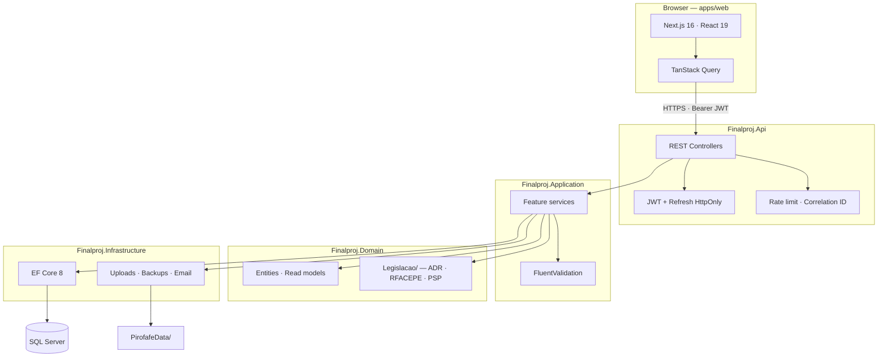

# Pyrotechnics Operations Platform

<p align="center">
  <strong>A full-stack management system tailored for a regulated pyrotechnics company — managing warehouses, real-time stock, orders, field services, and regulatory compliance.</strong>
</p>

<p align="center">
  <a href="https://github.com/Vie1r4/sistema-gestao-pirotecnica/actions/workflows/dotnet-tests.yml">
    
  </a>
  <a href="https://github.com/Vie1r4/sistema-gestao-pirotecnica/actions/workflows/client-ci.yml">
    
  </a>
  <a href="https://github.com/Vie1r4/sistema-gestao-pirotecnica/actions/workflows/fullstack-e2e.yml">
    
  </a>
</p>

---

Built for **Pirofafe** — a real pyrotechnics business. This repository contains the **management software** built from scratch to streamline operations and enforce strict safety regulations.

**Authors:** [Sérgio Henrique Oliveira Vieira](https://github.com/Vie1r4) · [LinkedIn](https://www.linkedin.com/in/s%C3%A9rgio-vieira-7b4290345/) · Tomás Campelos

---

## 💡 The Problem & The Solution

| Challenge | Our Solution |
| :--- | :--- |
| **Strict Regulations (ADR/RFACEPE)**<br>Warehouses (paióis) must respect compatibility rules, license categories, and explosive limits (MLE). | A dedicated Domain module `Legislacao/` acts as the single source of truth. The validation engine `MotorValidacaoPaiol` checks every entry before storage. |
| **Inventory & Orders**<br>Commercial and warehouse teams must coordinate orders without overselling or mixing incompatibilities. | Advanced order workflows (Pending → Accepted → In preparation → Completed) with dynamic stock reservations and FIFO allocation in `EncomendaService`. |
| **Field Events & PSP Compliance**<br>Field operations require safety distance calculations, crew licenses, and official PSP declaration PDFs. | An event planner with geographic mapping (Leaflet), automatic safety-radius calculation, and automated generation of official PSP declarations from templates. |

---

## 🛠 Tech Stack

- **Backend:** .NET 8 · ASP.NET Core · Entity Framework Core 8 · SQL Server
- **Frontend:** Next.js 16 · React 19 · TypeScript · Tailwind CSS · TanStack Query 5
- **Testing:** xUnit · Playwright E2E · Vitest

---

## 📐 Architecture

The backend follows the principles of **Clean Architecture**, enforcing a strict dependency flow where business rules remain isolated from databases and web frameworks.



<details>
<summary>📂 View Repository Layout</summary>

```
Finalproj/
├── src/Finalproj.Api/              # HTTP, Controllers, Middleware, Program.cs
├── src/Finalproj.Application/      # DTOs, Use Cases, Validators, Core Services
├── src/Finalproj.Domain/           # Entities, Value Objects, Legislacao/ Domain Rules
├── src/Finalproj.Infrastructure/   # DB Context, Repositories, Backups, Security Services
├── apps/web/                       # Next.js 16 frontend application
├── Finalproj.Tests/                # Domain and Application unit tests
├── Finalproj.IntegrationTests/     # Integration tests (Auth, security matrices, IDOR)
└── Docs/                           # Technical documentation and guides
```

</details>

---

## 🚀 Key Features & Technical Highlights

* **FIFO Stock Allocation:** SQL-backed available balance per lot, ensuring oldest-first allocation when warehouse teams prepare accepted orders.
* **Granular Security Matrices:** JWT access tokens in memory combined with HttpOnly cookies for refresh tokens. Custom role-based policies block unauthorized access at the controller level.
* **Automatic Dynamic Backups:** Robust daily database backups and document staging, with optional AES-256-GCM encryption at rest. Automatically maps physical database file paths for portable restores.
* **Robust Testing Pipeline:** Over 60% coverage guaranteed by xUnit unit tests, integration test suites verifying authorization matrices (`EndpointAuthorizationTests`) and cross-tenant checks (`IdorTests`), and full E2E flows with Playwright.
* **PSP Document Generation:** Automatic generation of complex Word/PDF reports using official regulatory templates.

---

## 🏁 Quick Start

### 📋 Prerequisites

* .NET 8 SDK
* Node.js 20+
* SQL Server (LocalDB or a local instance)

### 1. Configure User Secrets

Configure the required JWT and client environment settings for the API:

```bash
dotnet user-secrets set "Jwt:Secret" "your-secret-key-at-least-32-characters-long" --project src/Finalproj.Api/Finalproj.Api.csproj
dotnet user-secrets set "Jwt:Issuer" "Finalproj" --project src/Finalproj.Api/Finalproj.Api.csproj
dotnet user-secrets set "Jwt:Audience" "FinalprojUsers" --project src/Finalproj.Api/Finalproj.Api.csproj
dotnet user-secrets set "Frontend:BaseUrl" "http://localhost:3000" --project src/Finalproj.Api/Finalproj.Api.csproj
```

### 2. Run the Backend API

Start the .NET backend server:

```bash
dotnet run --project src/Finalproj.Api/Finalproj.Api.csproj
```

* API base URL: `https://localhost:7225`
* Swagger UI (Development only): `https://localhost:7225/swagger`

### 3. Run the Frontend App

Install dependencies and start the Next.js development server:

```bash
cd apps/web
cp .env.example .env.local
npm install
npm run dev
```

* Frontend application: [http://localhost:3000](http://localhost:3000)
* **First admin registration:** With `Bootstrap:AllowFirstUserRegistration=true` enabled in development settings, click **Create first user** on the login page to create the initial administrative account.

---

## 🧪 Testing

Execute the backend test suite:
```bash
dotnet test Finalproj.sln -c Release
```

Execute the frontend tests:
```bash
cd apps/web
npm test              # Vitest (Unit & Component tests)
npm run test:e2e      # Playwright (End-to-End tests)
```

---

## 🇵🇹 Resumo em Português

Aplicação **full-stack** para gestão de operações pirotécnicas (cliente **Pirofafe**): gestão de paióis e stock com validação ADR/RFACEPE, fluxo de encomendas com alocação FIFO, planeamento de serviços com mapas interativos, geração automática de declarações PSP em PDF, autenticação segura com JWT + cookies HttpOnly, e backups automáticos.

* Aceda à documentação completa na pasta [`Docs/`](Docs/README.md)
* Guia do Painel Admin: [`Docs/frontend/PAINEL-ADMIN.md`](Docs/frontend/PAINEL-ADMIN.md)

---

## 🔗 Links & Resources

* [Docs/CASE-STUDY.md](Docs/CASE-STUDY.md) — Case study & implementation history
* [Docs/README.md](Docs/README.md) — Document library index
* [Docs/ARCHITECTURE.md](Docs/ARCHITECTURE.md) — Layer conventions & system flow
* [Docs/API.md](Docs/API.md) — HTTP API reference & examples
* [Docs/SEGURANCA.md](Docs/SEGURANCA.md) — Security mechanisms & policies
* [Docs/OPERACOES.md](Docs/OPERACOES.md) — Backup schedules and local storage configuration
* [CONTRIBUTING.md](CONTRIBUTING.md) — Guidelines for adding features

---

## 📄 License

Academic / portfolio project. See repository settings for license terms.
