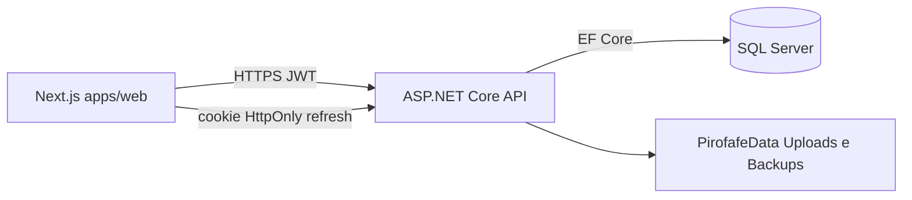

# PIROFAFE — Sistema de Gestão Pirotécnica

Aplicação full-stack: **backend** ASP.NET Core 8 (API REST + Identity) e **frontend** Next.js 16 (pasta `apps/web/`).

## Documentação

**Índice central:** [**Docs/README.md**](Docs/README.md)

| Área | Ligação rápida |
|------|----------------|
| **Iniciantes** | [Docs/guia-iniciantes.md](Docs/guia-iniciantes.md) |
| **Arquitetura** | [Docs/ARQUITETURA.md](Docs/ARQUITETURA.md) |
| **API** | [Docs/API.md](Docs/API.md) |
| **Testes** | [Docs/TESTES.md](Docs/TESTES.md) |
| **Segurança** | [Docs/SEGURANCA.md](Docs/SEGURANCA.md) |
| **Roles** | [Docs/ROLES-E-PERMISSOES.md](Docs/ROLES-E-PERMISSOES.md) |
| **Operações** | [Docs/OPERACOES.md](Docs/OPERACOES.md) |

## Arquitetura (resumo)



## Documentação interativa (Swagger)

Com o backend a correr em **Development**, a UI Swagger está em `/swagger` (ex.: [https://localhost:7225/swagger](https://localhost:7225/swagger)) — autenticação JWT com **Authorize** após `POST /api/auth/login`.

Em **Production** o Swagger fica **desligado** (não expor a superfície da API).

## Estrutura

```
Finalproj/
├── src/Finalproj.Api/              # API REST (controllers, Program.cs)
├── src/Finalproj.Application/      # Casos de uso, DTOs, validadores
├── src/Finalproj.Domain/           # Entidades e contratos
├── src/Finalproj.Infrastructure/   # EF Core, repositórios, serviços I/O
├── apps/web/                       # Frontend Next.js 16
├── Finalproj.Tests/                # Testes unitários (domínio)
├── Finalproj.IntegrationTests/     # Testes de integração HTTP (auth, 401/403)
└── Docs/                           # Documentação
```

- **`apps/web/`:** React 19, TanStack Query, Tailwind, Leaflet; chamadas API em `app/lib/*Api.ts`.
- Ver [CONTRIBUTING.md](CONTRIBUTING.md) para convenções e checklist de PR.

## Testes

```bash
dotnet test Finalproj.Tests/Finalproj.Tests.csproj
dotnet test Finalproj.IntegrationTests/Finalproj.IntegrationTests.csproj
```

Frontend:

```bash
cd apps/web
npm test              # Vitest (unitário)
npm run test:e2e      # Playwright E2E (arranca Next.js dev automaticamente)
```

- Integração backend: auth, matriz 401/403, IDOR — ver `Finalproj.IntegrationTests/`.
- E2E: login, rotas protegidas, CRUD funcionários (mocks), encomenda submeter — ver `apps/web/tests/e2e/`.
- **Cobertura:** o workflow [.NET tests](.github/workflows/dotnet-tests.yml) publica artefacto `coverage-report` (HTML); threshold ≥60% Domain/Application é meta futura, ainda informativo no CI.

Ver [Docs/TESTES.md](Docs/TESTES.md).

## Pré-requisitos

- .NET 8 SDK
- Node.js 18+ (para o frontend)
- SQL Server (LocalDB ou instância) para o backend

## Configuração do Backend

### Segredos (obrigatório)

O JWT e credenciais de email **não** devem estar em `appsettings.json`. Use **User Secrets** em desenvolvimento:

```bash
cd C:\Users\shovi\source\repos\Finalproj
dotnet user-secrets set "Jwt:Secret" "sua-chave-secreta-longa-com-pelo-menos-32-caracteres" --project src/Finalproj.Api/Finalproj.Api.csproj
dotnet user-secrets set "Jwt:Issuer" "Finalproj" --project src/Finalproj.Api/Finalproj.Api.csproj
dotnet user-secrets set "Jwt:Audience" "FinalprojUsers" --project src/Finalproj.Api/Finalproj.Api.csproj
# Opcional (email):
dotnet user-secrets set "Email:SmtpHost" "smtp.gmail.com" --project src/Finalproj.Api/Finalproj.Api.csproj
dotnet user-secrets set "Email:SmtpUser" "seu-email@gmail.com" --project src/Finalproj.Api/Finalproj.Api.csproj
dotnet user-secrets set "Email:SmtpPassword" "sua-password-app" --project src/Finalproj.Api/Finalproj.Api.csproj
dotnet user-secrets set "Email:From" "seu-email@gmail.com" --project src/Finalproj.Api/Finalproj.Api.csproj
dotnet user-secrets set "Frontend:BaseUrl" "http://localhost:3000" --project src/Finalproj.Api/Finalproj.Api.csproj
```

Em **produção**, use variáveis de ambiente ou Azure Key Vault (por exemplo `Jwt__Secret`, `Cors__AllowedOrigins`).

### Seed de utilizadores (opcional; desativado por defeito)

O projeto suporta criação opcional de contas de teste por cargo (admin/gestor/comercial/armazém) **apenas se** `SeedUsers:Enabled=true` e existir `SeedUsers:Password` definido via segredos (User Secrets / env vars).  
Por segurança, **não** guardes passwords de seed no repositório.

### CORS

Por defeito o backend aceita origens `http://localhost:3000` e `https://localhost:3000`. Em produção, defina:

- `Cors:AllowedOrigins` em appsettings ou variável de ambiente (ex.: `https://app.seudominio.pt`).

### Logs e correlation id

- Cada pedido HTTP recebe um **`X-Correlation-Id`** (header de resposta; opcional no pedido). Os logs de consola incluem **scopes** com `CorrelationId` e o tempo do pedido em milissegundos.
- Detalhes: [Docs/OPERACOES.md](Docs/OPERACOES.md).

### Backups automáticos da base de dados

O backend inclui um serviço automático de backups SQL Server (`BackgroundService`) com execução diária às **19:00**.

- Destino: ficheiros `.bak` em `PirofafeData/Backups/` junto ao projecto API (pastas criadas no arranque; ver `DadosLocais` e `Backups` em `appsettings`). Uploads de documentos ficam em `PirofafeData/Uploads/` — não versionados no Git.
- Configuração: secção `Backups` no `appsettings.json`.
- Documentação detalhada: [Docs/OPERACOES.md](Docs/OPERACOES.md).

## Executar

### 1. Backend

```bash
cd C:\Users\shovi\source\repos\Finalproj
dotnet run --project src/Finalproj.Api/Finalproj.Api.csproj
```

A API fica em `https://localhost:7225` (ou a porta em `src/Finalproj.Api/Properties/launchSettings.json`). Em Development, use o Swagger em `/swagger` para testar endpoints.

### 2. Frontend

```bash
cd apps/web
npm install
npm run dev
```

Abre [http://localhost:3000](http://localhost:3000). O frontend usa por defeito `https://localhost:7225` como base da API. Para alterar, crie `.env.local`:

```
NEXT_PUBLIC_API_URL=https://localhost:7225
```

Em produção, defina `NEXT_PUBLIC_API_URL` com a URL da API.

## Primeiro utilizador

Com `Bootstrap:AllowFirstUserRegistration=true` (por defeito em **Development**; `false` em `appsettings.json` de produção), a página de login mostra **Criar primeiro utilizador** enquanto ainda não existir nenhuma conta. Esse utilizador recebe a role Admin.

Após criar o primeiro admin em produção, defina `Bootstrap__AllowFirstUserRegistration=false` (ou na configuração equivalente) para desativar o bootstrap e evitar enumeração do estado da instalação.
